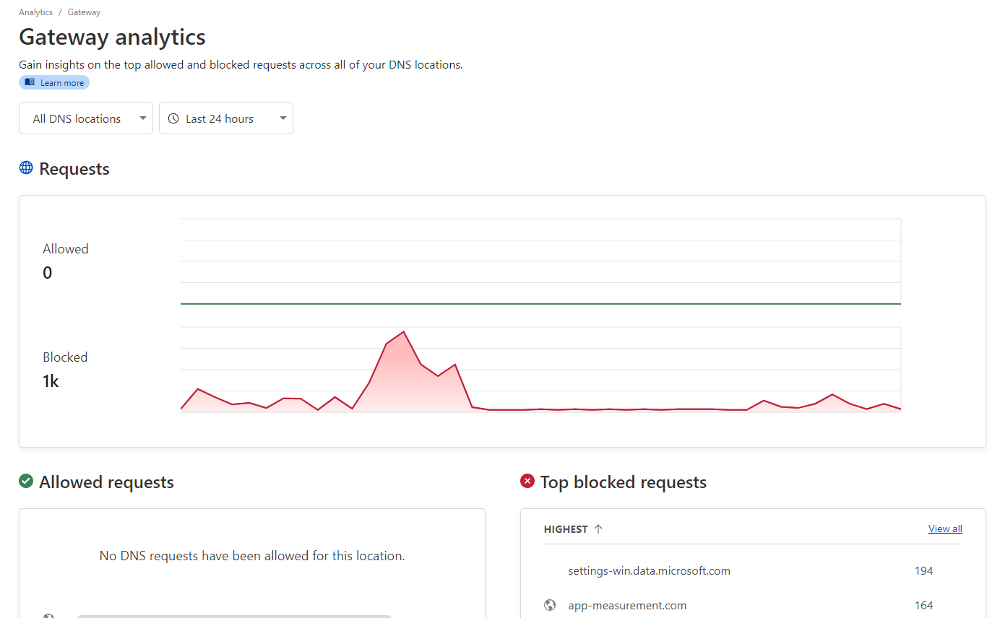

# Cloudflare Gateway Pi-hole Scripts (CGPS)

Cloudflare Gateway allows you to create custom rules to filter HTTP, DNS, and network traffic based on your firewall policies. This is a collection of scripts that can be used to get a similar experience as if you were using Pi-hole, but with Cloudflare Gateway - so no servers to maintain or need to buy a Raspberry Pi!

## About the individual scripts

- `cf_list_delete.js` - Deletes all lists created by CGPS from Cloudflare Gateway. This is useful for subsequent runs.
- `cf_list_create.js` - Takes a blocklist.txt file containing domains and creates lists in Cloudflare Gateway
- `cf_gateway_rule_create.js` - Creates a Cloudflare Gateway rule to block all traffic if it matches the lists created by CGPS.
- `cf_gateway_rule_delete.js` - Deletes the Cloudflare Gateway rule created by CGPS. Useful for subsequent runs.
- `download_lists.js` - Initiates blocklist and whitelist download.

## Features

- Support for basic hosts files
- Full support for domain lists
- Automatically cleans up filter lists: removes duplicates, invalid domains, comments and more
- Works **fully unattended**
- **Allowlist support**, allowing you to prevent false positives and breakage by forcing trusted domains to always be unblocked.
- Experimental **SNI-based filtering** support that works independently of DNS settings, preventing unauthorized or malicious DNS changes from bypassing the filter.
- Optional health check: Sends a ping request ensuring continuous monitoring and alerting for the workflow execution, or messages a Discord webhook with progress.

## Usage

### Prerequisites

1. Node.js installed on your machine
2. Cloudflare [Zero Trust](https://one.dash.cloudflare.com/) account - the Free plan is enough. Use the Cloudflare [documentation](https://developers.cloudflare.com/cloudflare-one/) for details.
3. Cloudflare email, API **token** with Zero Trust read and edit permissions, and account ID. See [here](https://github.com/mrrfv/cloudflare-gateway-pihole-scripts/blob/main/extended_guide.md#cloudflare_api_token) for more information about how to create the token.
4. A file containing the domains you want to block - **max 300,000 domains for the free plan** - in the working directory named `blocklist.txt`. Mullvad provides awesome [DNS blocklists](https://github.com/mullvad/dns-blocklists) that work well with this project. A script that downloads recommended blocklists, `download_lists.js`, is included.
5. Optional: You can whitelist domains by putting them in a file `allowlist.txt`. You can also use the `get_recomended_whitelist.sh` Bash script to get the recommended whitelists.
6. Optional: A Discord (or similar) webhook URL to send notifications to.

### Running locally

1. Clone this repository.
2. Run `npm install` to install dependencies.
3. Copy `.env.example` to `.env` and fill in the values.
4. If this is a subsequent run, execute `node cf_gateway_rule_delete.js` and `node cf_list_delete.js` (in order) to delete old data.
5. If you haven't downloaded any filters yourself, run the `node download_lists.js` command to download recommended filter lists (about 250 000 domains).
6. Run `node cf_list_create.js` to create the lists in Cloudflare Gateway. This will take a while.
7. Run `node cf_gateway_rule_create.js` to create the firewall rule in Cloudflare Gateway.
8. Profit!

### Running in GitHub Actions

These scripts can be run using GitHub Actions so your filters will be automatically updated and pushed to Cloudflare Gateway. This is useful if you are using a frequently updated malware blocklist.

Please note that the GitHub Action downloads the recommended blocklists and whitelist by default. You can change this behavior by setting Actions variables.

1. Create a new empty, private repository. Forking or public repositories are discouraged, but supported - although the script never leaks your API keys and GitHub Actions secrets are automatically redacted from the logs, it's better to be safe than sorry. There is **no need to use the "Sync fork" button** if you're doing that! The GitHub Action downloads the latest code regardless of what's in your forked repository.
2. Create the following GitHub Actions secrets in your repository settings:
   - `CLOUDFLARE_API_TOKEN`: Your Cloudflare API Token with Zero Trust read and edit permissions
   - `CLOUDFLARE_ACCOUNT_ID`: Your Cloudflare account ID
   - `CLOUDFLARE_LIST_ITEM_LIMIT`: The maximum number of blocked domains allowed for your Cloudflare Zero Trust plan. Default to 300,000. Optional if you are using the free plan.
   - `PING_URL`: /Optional/ The HTTP(S) URL to ping (using curl) after the GitHub Action has successfully updated your filters. Useful for monitoring.
   - `DISCORD_WEBHOOK_URL`: /Optional/ The Discord (or similar) webhook URL to send notifications to. Good for monitoring as well.
3. Create the following GitHub Actions variables in your repository settings if you desire:
   - `FAST_MODE`: Enable the scripts to send the requests simultaneously. Beware that there's a rate limit of 1200 requests per five minutes (<https://developers.cloudflare.com/fundamentals/api/reference/limits/>) so make sure you know what you are doing.
   - `ALLOWLIST_URLS`: Uses your own allowlists. One URL per line. Recommended allowlists will be used if this variable is not provided.
   - `BLOCKLIST_URLS`: Uses your own blocklists. One URL per line. Recommended blocklists will be used if this variable is not provided.
   - `BLOCK_PAGE_ENABLED`: Enable showing block page if host is blocked.
4. Create a new file in the repository named `.github/workflows/main.yml` with the contents of `auto_update_github_action.yml` found in this repository. The default settings will update your filters every week at 3 AM UTC. You can change this by editing the `schedule` property.
5. Enable GitHub Actions in your repository settings.

### DNS setup for Cloudflare Gateway

1. Go to your Cloudflare Zero Trust dashboard, and navigate to Gateway -> DNS Locations.
2. Click on the default location or create one if it doesn't exist.
3. Configure your router or device based on the provided DNS addresses.

Alternatively, you can install the Cloudflare WARP client and log in to Zero Trust. This method proxies your traffic over Cloudflare servers, meaning it works similarly to a commercial VPN. You need to do this if you want to use the SNI-based filtering feature, as it requires Cloudflare to inspect your raw traffic (HTTPS remains encrypted if "TLS decryption" is disabled).

### Dry runs

To see if e.g. your filter lists are valid without actually changing anything in your Cloudflare account, you can set the `DRY_RUN` environment variable to 1, either in `.env` or the regular way. This will only print info such as the lists that would be created or the amount of duplicate domains to the console.

**Warning:** This currently only works for `cf_list_create.js`.

<!-- markdownlint-disable-next-line MD026 -->
## Why not...

### Pi-hole or Adguard Home?

- Complex setup to get it working outside your home
- Requires a Raspberry Pi

### NextDNS?

- DNS filtering is disabled after 300,000 queries per month on the free plan

### Cloudflare Gateway?

- Requires a valid payment card or PayPal account
- Limit of 300k domains on the free plan

### a hosts file?

- Potential performance issues, especially on [Windows](https://github.com/StevenBlack/hosts/issues/93)
- No filter updates
- Doesn't work for your mobile device
- No statistics on how many domains you've blocked

## License

MIT License. See `LICENSE` for more information.
