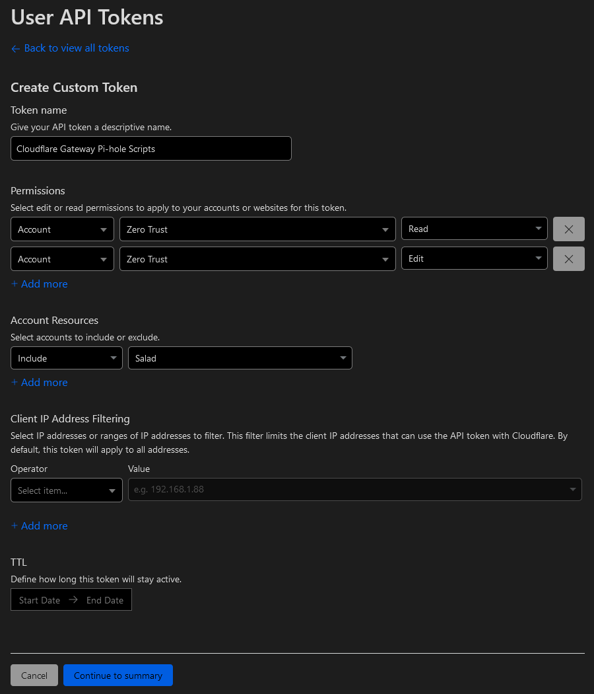

# Extended Guide

## Environment variables

Environment variables are like a configuration file. They are stored in a file called `.env` in the same directory as the scripts. You have to create this file yourself (an example file is provided in the repository). Below is a list of the most important environment variables and their descriptions.

### Obtaining your Cloudflare credentials

#### `CLOUDFLARE_ACCOUNT_ID`

You can find your Cloudflare account ID in the [Cloudflare dashboard](https://dash.cloudflare.com/). Click on any domain you own, then on the "Overview" tab. Scroll down to the bottom of the page and you will see your account ID on the right side.

Alternatively, you can copy the account ID from the URL of any page in the Cloudflare dashboard. The URL will look like this:

```text
https://dash.cloudflare.com/1234567890abcdef1234567890abcdef
```

In this example, `1234567890abcdef1234567890abcdef` is the account ID.

#### `CLOUDFLARE_API_TOKEN`

Cloudflare API Token can be created in your [Cloudflare profile](https://dash.cloudflare.com/profile/api-tokens):

1. Click "Create Token" and click "Get Started" in the "Create Custom Token" row.
2. Enter any name for your token
3. Add Zero Trust Read and Edit permissions for your account
4. Click "Continue to summary" and click "Create Token"
5. You will see the created API Token



#### `CLOUDFLARE_LIST_ITEM_LIMIT`

The Cloudflare list item limit is the maximum number of items (blocked domains) that can be added to Cloudflare. The default value of 300,000 is the maximum allowed by Cloudflare for free accounts. If you pay for Cloudflare Zero Trust, you might be able to increase this value.

### Other

#### `DRY_RUN`

Processes block/allow lists without actually adding/removing domains from Cloudflare. Avoid using this option unless you know what you are doing.

#### `FAST_MODE`

Sends requests much faster, but might cause rate limiting issues. Use with caution.

## Example usage

These commands should be run in a terminal.

```bash
# Assumes you have already cloned the repository and installed dependencies such as git and node.js.

# 1. Clone the repository
git clone https://github.com/mrrfv/cloudflare-gateway-pihole-scripts
cd cloudflare-gateway-pihole-scripts # change the current directory to the cloned repository
# 2. Run npm install to install dependencies.
npm install
# 3.1. Copy the example.env file to .env
# Files starting with a dot are hidden by default on Linux and macOS.
cp example.env .env
# 3.2. Edit the .env file and add your Cloudflare credentials.
# (This command varies depending on your system and preferred text editor.)
nano .env
# 4. If this is a subsequent run, execute node cf_gateway_rule_delete.js and node cf_list_delete.js (in order) to delete old data.
# Not needed if setting up for the first time.
node cf_gateway_rule_delete.js
node cf_list_delete.js
# 5. Download the default filter lists.
# If you want to use your own lists, put your blocked and allowed domains in files called "blocklist.txt" and "allowlist.txt" respectively.
node download_lists.js
# 6. Send the filter lists to Cloudflare.
node cf_list_create.js
# 7. Add the Cloudflare firewall rule.
node cf_gateway_rule_create.js
# Set up your DNS settings to use Cloudflare Gateway if you haven't already.
# 8. Profit!
ping google-analytics.com
```
